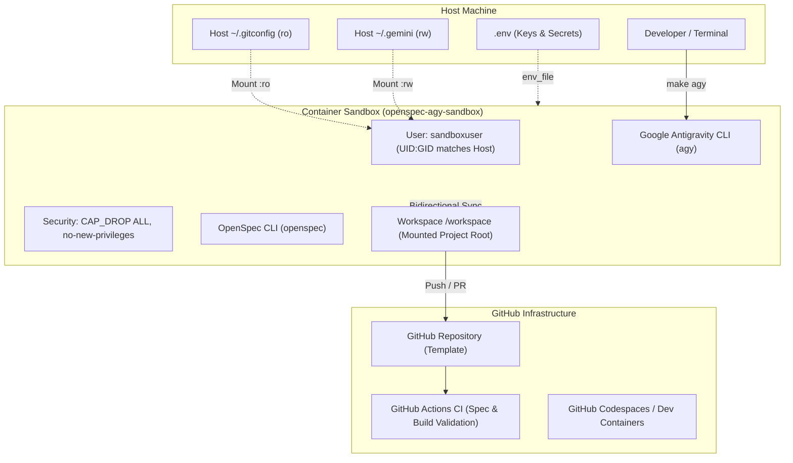

# OpenSpec Antigravity Docker Bootstrapper

[](https://github.com/your-org/openspec-agy-docker/actions/workflows/ci.yml)
[](https://www.docker.com/)
[](https://github.com/Fission-AI/OpenSpec)
[](https://antigravity.google)
[](https://opensource.org/licenses/MIT)

A bootstrapping framework and tool to create new software projects powered by **Google Antigravity CLI (`agy`)** and **OpenSpec (`@fission-ai/openspec`)**, running safely from within a hardened containerized environment using **GitHub** as development and deployment infrastructure.

---

## Architecture Overview



### Key Security & Operational Guarantees
* **Unprivileged Isolation:** The container runs as `sandboxuser` with dynamically mapped `UID:GID` matching the host developer (`id -u` / `id -g`). All created files retain host ownership, eliminating root file ownership permission issues.
* **Kernel Hardening:** Linux capabilities are completely dropped (`cap_drop: [ALL]`) and privilege escalation is blocked (`no-new-privileges:true`).
* **Secrets Containment:** Third-party AI API keys (`OPENAI_API_KEY`, `ANTHROPIC_API_KEY`) are passed via `.env` through Docker Compose and never committed to Git.
* **Seamless Gemini Authentication:** Host cached OAuth tokens (`~/.gemini`) are mounted directly, enabling immediate CLI operation without needing a browser inside the container.
* **Spec-Driven Governance:** OpenSpec is integrated to formalize system changes before code generation (`/opsx:propose`, `/opsx:apply`, `/opsx:archive`).

---

## 1. Installation

Install the `create-agy-project` bootstrapping CLI tool onto your host machine:

```bash
# Clone this repository
git clone https://github.com/your-org/openspec-agy-docker.git
cd openspec-agy-docker

# Install create-agy-project into ~/.local/bin
make install
# Alternatively: ./install.sh
```

Ensure `~/.local/bin` is in your shell's `$PATH`:
```bash
export PATH="$PATH:$HOME/.local/bin"
```

---

## 2. Creating New Projects

You can scaffold new projects using either the local CLI or GitHub Templates:

### Workflow A: Using the Local CLI (Recommended)
Run `create-agy-project` specifying the destination directory:

```bash
create-agy-project ~/Developer/my-new-project --name "My New AI Agent"
```

This single command:
1. Creates the target directory.
2. Initializes a new Git repository (`main` branch) with an initial commit.
3. Sets up the containerized runtime (`Dockerfile`, `docker-compose.yaml`, `docker-entrypoint.sh`).
4. Injects Antigravity sandbox rules (`.agents/rules/sandbox.md`).
5. Configures OpenSpec (`openspec/config.yaml` and baseline specifications).
6. Configures GitHub Actions CI (`.github/workflows/ci.yml`) and Dev Containers (`.devcontainer/`).

### Workflow B: Using GitHub Templates
1. Click **"Use this template"** > **"Create a new repository"** on GitHub.
2. Clone your newly created repository:
   ```bash
   git clone git@github.com:your-username/my-new-project.git
   cd my-new-project
   ```

---

## 3. Quick Start in a Project

Inside your new project directory:

### Step 1: Configure Environment
```bash
cp .env.example .env
```
*(Optional: If running in a headless VM without host `~/.gemini` credentials, set `GEMINI_API_KEY="your-api-key"` in `.env`.)*

### Step 2: Build the Container Image
```bash
make build
```

### Step 3: Launch Antigravity CLI
```bash
make agy
```

---

## 4. Development & OpenSpec Workflow

Once inside the Antigravity session or running from your host:

### Antigravity CLI Interaction
* **Interactive Session:** `make agy`
* **Headless Prompt:** `make agy-cmd PROMPT="Implement user authentication module"`
* **Sandbox Shell:** `make shell` (opens an interactive Bash shell inside the container)

### OpenSpec Spec-Driven Development (SDD)
OpenSpec commands can be executed via `make openspec`:
* **Explore requirements:** `make openspec ARGS="list"`
* **Propose a change:** Inside `agy`, use `/opsx:propose` to draft specs, design docs, and tasks.
* **Apply a change:** Inside `agy`, use `/opsx:apply` to implement tasks against the approved spec.
* **Archive completed changes:** Inside `agy`, use `/opsx:archive`.
* **Validate specifications:** `make validate` (runs `openspec validate --all --no-interactive`).

---

## 5. GitHub Cloud Infrastructure & CI/CD

Each project scaffolded by this tool includes pre-configured GitHub Actions (`.github/workflows/ci.yml`):
* **Spec Validation Job:** Validates OpenSpec changes and schemas using `npx @fission-ai/openspec validate --all --strict`.
* **Container Build Job:** Builds and verifies the Docker Compose configuration on clean Ubuntu runners.
* **Hygiene & Secrets Job:** Audits the repository to ensure `.env` and sensitive tokens are never committed.
* **GitHub Codespaces:** Includes `.devcontainer/devcontainer.json` for 1-click cloud-based development directly in your browser.

---

## 6. Project Reference Commands

| Command | Description |
| :--- | :--- |
| `make install` | Installs `create-agy-project` into `~/.local/bin` |
| `make new-project DIR=...` | Scaffolds a new project directory via Make |
| `make build` | Builds the Docker sandbox image matching host `UID:GID` |
| `make agy` | Launches interactive Antigravity CLI in the container |
| `make agy-cmd PROMPT="..."` | Runs a non-interactive Antigravity prompt |
| `make openspec ARGS="..."` | Executes OpenSpec CLI commands in the container |
| `make validate` | Runs strict OpenSpec specification validation |
| `make shell` | Drops into an interactive bash shell in the container |
| `make clean` | Removes dangling sandbox containers and networks |

---

## 7. License

This project is licensed under the [MIT License](LICENSE). You are free to use, modify, distribute, and integrate this bootstrapping template into both open-source and commercial projects.

